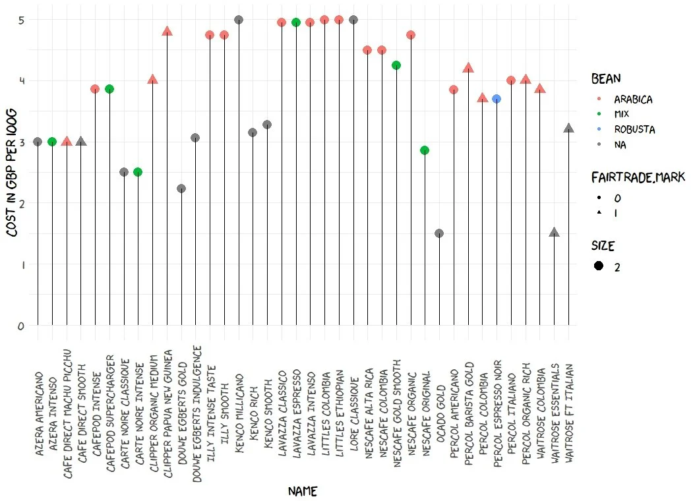
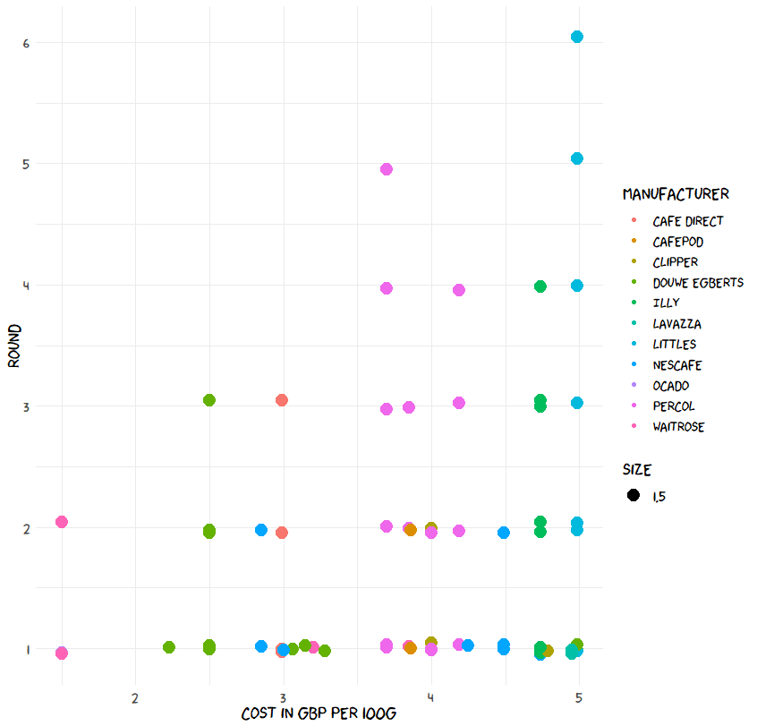
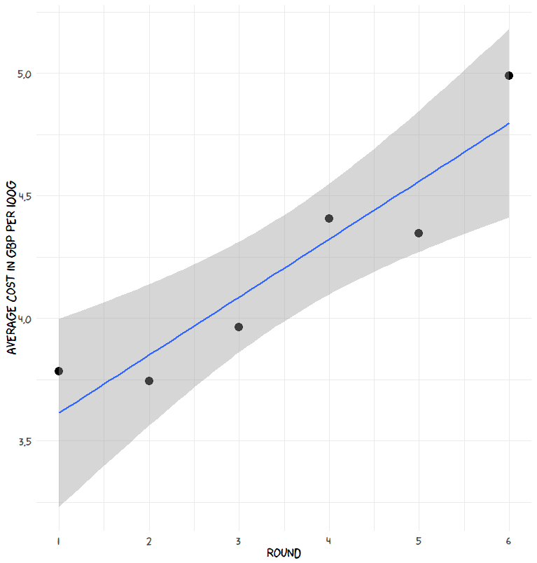
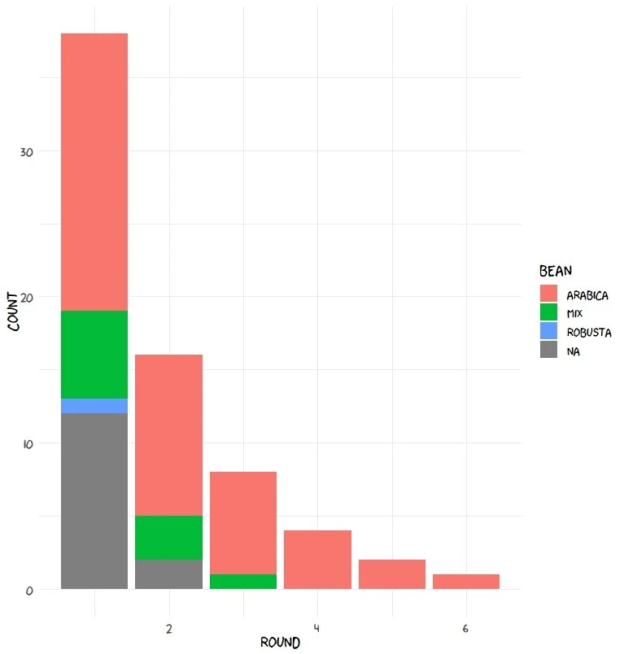
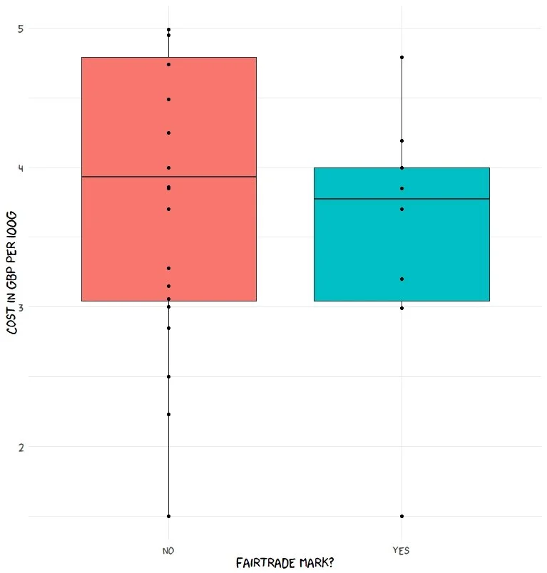
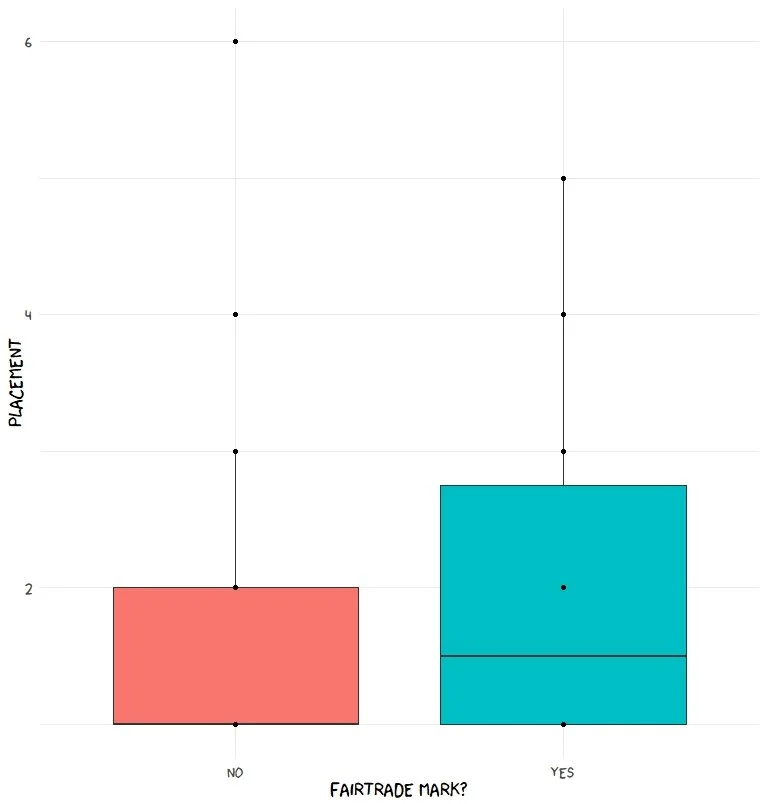
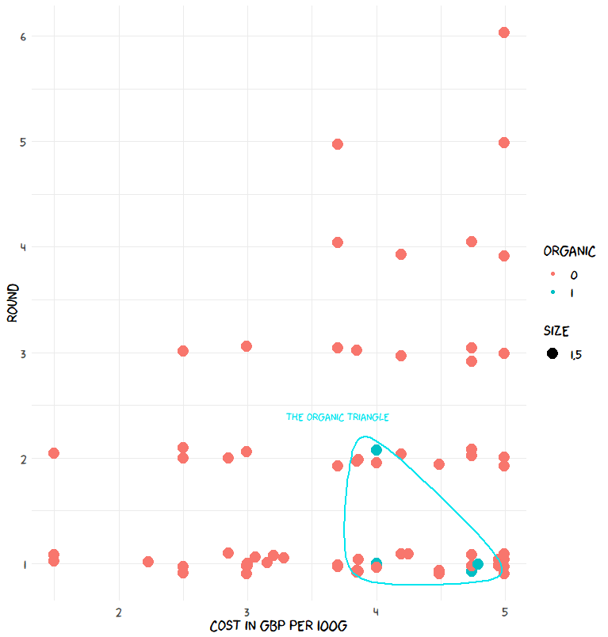
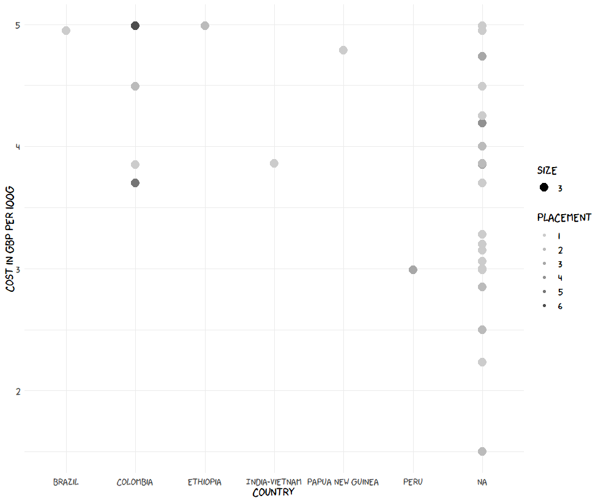

## Visualizing differences in instant coffee

This project was inspired and based on data from James Hoffmann's video in which he does a bracket competition of 38 different instant coffees to see which one tasted the "best". You can skip directly to the analysis below but I would highly recommend watching his video to gain full context.

## Basic info about the products

Here is a quick breakdown of all of the different coffees, their price, bean type, and if they have a FairTrade Mark from FairTrade International*

Quickly we can see that a large number of the coffees are Arabica (pink) and there is a fairly wide range in price form 1.5 to 5 pounds/100g.

- Total number of entries: 38
- Number of fairtrade marked: 10
- Number of organic products**: 4

*Obviously a fairtrade marking does not make a product de facto good for the producers but it is an additional data point to differentiate the products. More on this later…

** not shown on chart

## Do you need to pay more for a good cup of instant coffee?

Round 1 had 38 entries while round 6 is the winner.

This shows that **paying more does increase the chance of having a better cup of coffee**. There appears to be some **separation at ~3.5 pound/100g**. No coffee below this price moved past the third round, so that would be my minimum price I would set when shopping.

### So does paying more guarantee a better cup of coffee?

Most likely not. There is a correlation but it's not amazing.

I graphed the average price at each round and calculated a linear fit to the data which is displayed as the blue line. The equation of this line is:

(Average cost/100g) = 3.377+ 0.2365*Round

R^2: 0.8698

So the average cost per 100g increases by 0.24 pence each round. So an increase from the first round to the final round is ~ 1.25 pounds (GBP)

Important to remember this is an average and the is significant variation in the data in each round (except the last).

## Does one bean reign supreme?

So price may not be the best determinate of a quality instant cup, but perhaps the type of bean is a better indicator?

Sifting through a variety of websites I was able to find bean information for 26 of the coffees. Note: I did not separate between blends of a single bean, so arabica includes arabica blends.

From this we see that **arabica is dominant** and all coffees that got to round 3 had at least some arabica beans. It would appear a purposeful omission that the coffees that did not advertise the bean type as they all scored lower (and are presumably a lower quality).

Quality comes with cost as **arabica was also the most expensive bean on average** (4.33 pound/100g), mix was next (3.57 pound/100g) and unknown was least expensive (3.03 pound/100g).

Robusta average cost was 3.7 pound/100g but with an N=1

## Does fairtrade cost more? And can you taste the difference?

As James points out in his video, instant coffee can be particularly poor for producers since margins are even thinner and may get paid less.

If you are trying to ensure that a producer receives their fair share, will that cost you, the consumer, more at checkout?

For this analysis I only counted coffees that had received a FairTrade mark. Most manufacturers claimed to have some sustainability and fairness doctrine on their website but without some semblance of third party oversight, I didn't have the time nor resources to ensure that they were following through with these promises.

Does being fairtrade also make the product taste better?

Obviously this is purely subjective based on James's tasting but thought it would be interesting to review as well.

Interestingly **FairTrade Marked coffee was on average slightly cheaper** (3.52 pound/100g) than non marked products (3.97 pound/100g). The median prices were very similar as shown in the box plot above.

It appears that being marked as FairTrade is, by itself, **not** indicative of **a more expensive product**.

FairTrade Marked products also place higher in the bracket than their non marked counterparts. I don't think this is as clear cut and there isn't any direct reason this should be the case. Could be an area for further exploration.

(For the record, I am not affiliated in any way with FairTrade International. Feels weird to say that but figure it is important to state).

## But what if it's organic?

There were only 4 organic entries so it is hard to glean much information. Looking at the comparison between round cost we discover the **Organic Triangle**. An unfortunate area in the bottom right of the graph where all organic entries ended up. This indicates that they are among the **most expensive** and the **worst tasting**. That being said there are a significant number of non-organic coffees that also did not make it past this area.

Probably still good for the earth to buy organic but not great results for the consumer (or their wallet).

## Does displaying the country of origin mean anything?

Sure, it means you are going to pay more.

Most all of the countries that listed where their coffee was produced (not just processed, looking at you Lavazza) had prices at the top of the range with a few exceptions. High prices was not restricted to products with a known origin as there were plenty of unknown production locations that also charged top dollar.

The products with known country of origin did perform well overall and included the winning coffee.

## So what did we learn?

Hard to say really. I've only had instant coffee when it's the only option and I don't see myself buying any of these products soon. (That's partially because most are sold only in the UK, but mainly because they are instant)

We can conclude that it is probably worth it to pay more than 3.5 pound/100g, arabica is a safer bet than a mix or robusta, fairtrade doesn't mean expensive (and doesn't necessarily mean good for the producer either), organic is probably good for the world but it's not clear if it will taste good, and knowing the origin will probably cost you (but may be worth it).

This data is pretty interesting but it is limited in several ways. By doing a bracket rather than ranking all of the products from 1 to 38 makes drawing conclusions more difficult as it is already binned and we lose granularity. There are a small number of organic coffees and very few countries of origin which makes conclusions on those points difficult. Getting data was difficult and is most likely incomplete. I have some notes below on the data and a link to my GitHub where you can download and play with the data.

Thanks for reading!

GitHub link: [github.com/sburkot24](https://github.com/sburkot24)

## Acknowledgements

Big thanks to James for providing his tastebuds and entertaining videos for this data.

Reddit user /u/violentgrumble who compiled the bracket and got me started doing this extra analysis ([link](https://www.reddit.com/r/JamesHoffmann/comments/gppbb2/i_have_three_essays_due_this_week_so_of_course_i/))

Emilio Torres-Manzanera for building the xkcd package for R. And Randall Munroe for creating xkcd.

R Core Team (2013). R: A language and environment for statistical computing. R Foundation for Statistical Computing, Vienna, Austria. URL [http://www.R-project.org/](http://www.R-project.org/)

## Notes

Shout out to Tesco for having the manufacturer contact info on the product page which usually linked back to the coffee parent company. From this I learned that Kenco, L'or and Carte Noire were all actually Douwe Egbert companies

**Tidbits:**

- Cafe direct smooth listed country of origin as "Latin America and Africa" which….is a little vague, so eliminated it
- Nescafe alta rica had Latin America as origin which was also too vague so deleted it
- Couldn't find anything on Ocado. Seems like it's a british grocery delivery service. If anyone can provide info on if it's organic/fairtrade/origin that would be helpful
- Couldn't find information on illy intense *instant* coffee, only the pod version so it's entry is based on that
